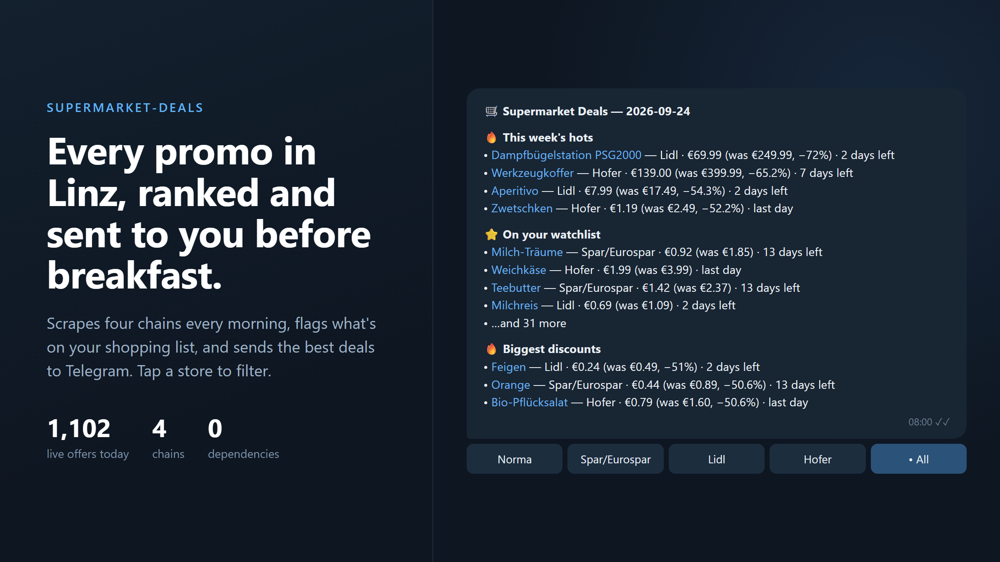

<div align="center">



# supermarket-deals

**A zero-dependency Python pipeline that scrapes every supermarket promo in Linz, ranks it
against your shopping list, and sends it to Telegram every morning.**


-555)

</div>

---

## Why

Weekly supermarket leaflets are built to make you browse. This one reads them for you. Every
morning it pulls **~1,100 live offers** from Norma, Spar/Eurospar, Lidl and Hofer, removes the
expired and not-yet-valid ones, and sends you three short lists:

| Section | What's in it |
|---|---|
| 🔥 **This week's hots** | The biggest percentage cuts across all four chains |
| ⭐ **On your watchlist** | Anything you buy regularly (`watchlist.txt`) that's on sale today |
| 🔥 **Biggest discounts** | The top 10 of everything else |

Every line shows the price, the old price, the store, and **how many days the deal has left**.
Tap a store button under the message and the digest is re-ranked for that store only.

## Highlights

- **Reverse-engineered data source.** The original source (Aktionsfinder.at) shut down, so the
  scraper uses marktguru.at's JSON backend. It pulls the API keys from the site's own boot
  config at runtime and re-scrapes them automatically when they rotate.
- **~100% coverage per chain.** One query per store brand replaces a 90-keyword sweep and
  roughly doubled coverage (Lidl 217 → 464 offers, Spar group 60 → 360).
- **Interactive bot, no server.** `bot.py` long-polls Telegram, so it needs no public URL,
  no TLS, and no webhook. It edits the digest in place when you tap a filter.
- **Standard library only.** No `pip install` step.
- **Runs anywhere.** Windows Task Scheduler scripts, or an always-on Linux VM with the
  systemd units in `deploy/`.
- **Obsidian log.** Each day's digest is also appended to a Markdown note, so you get a
  searchable price history.
- **Documented decisions.** Every design choice and revision is recorded as an ADR in
  [`DECISIONS.md`](DECISIONS.md).

## How it works

1. `sources/marktguru.py` scrapes the marktguru.at API keys from the homepage,
   runs one `offers/search` query per tracked banner (the banner name is itself
   a valid query returning that banner's full offer set), dedupes by offer id,
   filters to the tracked banners client-side, and normalizes each hit to an
   `Offer`. Falls back to a keyword sweep only for a banner that returns nothing.
2. `store.py` writes a rolling `data/deals.json` (deduped by
   `retailer|product|valid_to`; expired offers dropped, undated offers aged out
   after 28 days) plus a raw daily snapshot `data/deals-<date>.json`.
3. `rank.py` drops offers that are expired or not yet started, matches the rest
   against `watchlist.txt`, and picks the top 10 by discount for everything else.
4. `notify.py` sends the Telegram message; `vault.py` appends the same content
   to the vault note.
5. `run.py` orchestrates all of the above.

## One-time setup

```powershell
pip install -r requirements.txt   # no third-party deps, just a no-op check
copy config.example.ini config.ini   # then fill in the real bot token + chat id
notepad watchlist.txt                 # add your regular products (see file header)
powershell -ExecutionPolicy Bypass -File install-task.ps1
```

`config.ini` and `.keys.json` are gitignored. Never commit them.

## Running manually

```powershell
python run.py --dry-run     # print message + per-retailer counts, write/send nothing
python run.py               # full run: store + vault + Telegram
python run.py --no-telegram # store + vault only
python run.py --no-vault    # store + Telegram only
```

Exit code is non-zero on hard failure (all sources returned 0 offers, or the
Telegram API rejected the message).

## Interactive filter bot (`bot.py`)

The daily digest carries an inline keyboard: one button per tracked store plus
**All**. Tapping a store button edits the digest message in place to show only
that store's deals (re-ranked from `data/deals.json`); **All** restores the full
digest. The active view's button is marked with a "• ".

This is a separate always-on process — `run.py` does not depend on it.

```powershell
python bot.py          # long-poll forever (getUpdates)
python bot.py --once    # process one batch of updates and exit (for testing)
powershell -ExecutionPolicy Bypass -File install-bot-task.ps1
```

`install-bot-task.ps1` registers the per-user task **SupermarketDealsBot** (runs
at logon, restarts up to 3× a minute apart, no admin). Uninstall:
`Unregister-ScheduledTask -TaskName "SupermarketDealsBot" -Confirm:$false`.

State: `run.py` writes `data/last_digest.json` (`chat_id` / `message_id` / `date`)
so a button tap or `/start` still works after the bot restarts; `bot.py` tracks
its update `offset` in `data/bot_offset.json`. Only one poller may run at once —
a Telegram 409 "conflict" is logged and the bot exits non-zero.

**Caveat:** like the daily task, the bot is down whenever the PC is off or
asleep. Taps made while it's down are processed when it next starts.

## Changing stores or zip code

- Zip: edit the `zip_code="4020"` argument in `run.py` (`fetch_all`).
- Stores: edit `RETAILERS` / `RETAILER_LABELS` in `sources/marktguru.py`. Use the
  marktguru advertiser `uniqueName` (e.g. `lidl`, `hofer`, `norma`, `eurospar`,
  `spar`, `interspar`, `penny`, `billa`, `billa-plus`).

## The vault note

By default each day's section is appended to `data/supermarket-deals.md`. To write into an
Obsidian vault instead, set `[vault] path` in `config.ini`. Re-running on the same day replaces
that day's section instead of duplicating it.

## Troubleshooting

- **Key scrape fails** (`could not locate API keys on marktguru.at`): the
  homepage layout changed. Delete `.keys.json`, open
  <https://www.marktguru.at/> source, search for `"apiKey"` / `"clientKey"` in
  the inline `application/json` config block, and adjust the regex in
  `sources/marktguru.py::_scrape_keys`. The app auto-re-scrapes on HTTP 401/403.
- **0 offers**: usually a transient network problem to `api.marktguru.at`
  (per-banner failures are tolerated and printed, then a keyword fallback runs).
  Re-run. If it persists, check the API is reachable and delete `.keys.json`.
- **Telegram 400**: bad token/chat id in `config.ini`, or HTML in a product name
  broke `parse_mode=HTML`. Check the printed `telegram error:` payload.
- The scheduled task only runs while the PC is on and awake (task is set to
  start as soon as possible if a run was missed).

## marktguru.at API notes

See the top of `sources/marktguru.py`. Endpoint:
`GET https://api.marktguru.at/api/v1/offers/search?as=web&q=<term>&zipCode=4020&limit=1000&offset=0`
with headers `X-ApiKey` / `X-ClientKey`. `q` is mandatory (empty / `*` / single
letters return nothing) but the banner name itself (`q=lidl`) is a valid query
that returns that banner's entire offer set, so we query one term per banner.
`allowedRetailers` is ignored by the backend, so retailers are still filtered
client-side on `advertisers[].uniqueName`.

## License

MIT. See [LICENSE](LICENSE).
